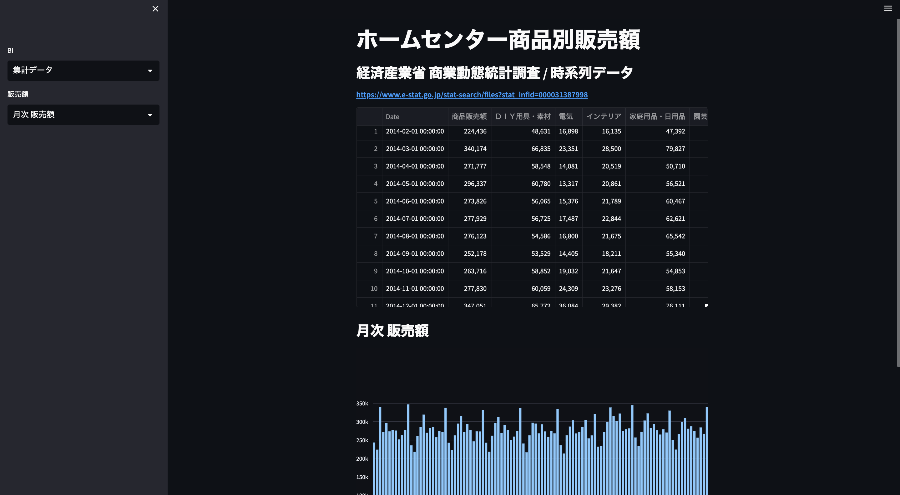
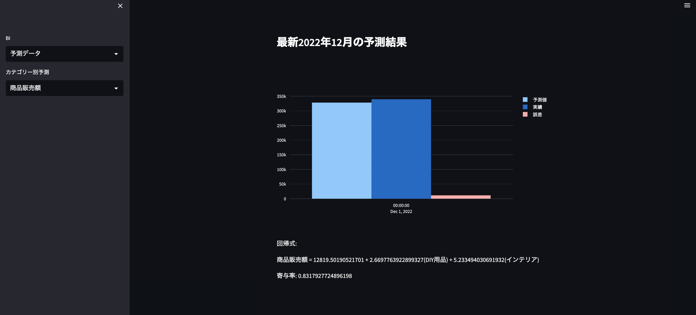

# 売上データを用いた深層学習ベースの予測・可視化アプリ





## アプリケーションの起動方法
```bash
streamlit run view.py
```

### 開発環境

| 項目 | 使用技術 |
|------|----------|
| 言語 | Python |
| データ分析 | Jupyter Notebook / pandas / NumPy / SciPy |
| 機械学習 | PyTorch / scikit-learn |
| データ可視化・アプリケーション | Plotly / Streamlit |
| データ処理・その他 | Excelデータ処理（xlrd） |
